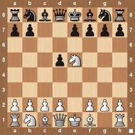
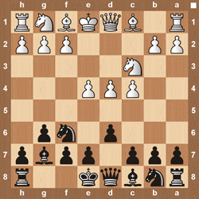
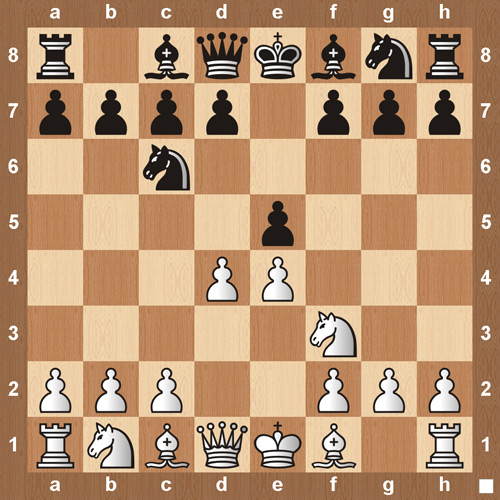

---
---
Chess openings
==============

* [Adelaide Counter Gambit]({{site.baseurl}}) \

* [Albin Counter-Gambit]({{site.baseurl}}) \

* [Alekhine Defense]({{site.baseurl}}) \

* [Apocalypse Attack]({{site.baseurl}}) \

* [Baltic Defense]({{site.baseurl}}) \

* [Belgrade Gambit]({{site.baseurl}}) \

* [Benoni Defense]({{site.baseurl}}) \

* [Bird’s Opening]({{site.baseurl}}) \

* [Bishop’s Opening]({{site.baseurl}}) \

* [Black Knights Tango]({{site.baseurl}}) \

* [Blackmar-Diemer Gambit]({{site.baseurl}}) \

* [Bogo Indian Defense]({{site.baseurl}}) \

* [Bowlder Attack]({{site.baseurl}}) \

* [Budapest Gambit]({{site.baseurl}}) \

* [Calabrese Countergambit]({{site.baseurl}}) \

* [Caro-Kann]({{site.baseurl}}) \

* [Catalan Opening]({{site.baseurl}}) \

* [Chigorin Defense]({{site.baseurl}}) \

* [Cochrane Gambit]({{site.baseurl}}) \

* [Colorado Gambit]({{site.baseurl}}) \

* [Danish Gambit]({{site.baseurl}}) \

* [Dutch Defense]({{site.baseurl}}) \

* [Elephant Gambit]({{site.baseurl}}) \

* [English Opening]({{site.baseurl}}) \

* [Evans Gambit]({{site.baseurl}}) \

* [Fajarowicz Gambit]({{site.baseurl}}) \

* [Falkbeer Counter-Gambit]({{site.baseurl}}) \

* [Four Knights Game]({{site.baseurl}}) \

* [French Defense]({{site.baseurl}}) \

* [Fried Liver Attack]({{site.baseurl}}) \

* [Gianutio Counter Gambit]({{site.baseurl}}) \

* [Giuoco Piano]({{site.baseurl}}) \

* [Goring Gambit]({{site.baseurl}}) \

* [Grand Prix Attack]({{site.baseurl}}) \

* [Grob Attack]({{site.baseurl}}) \

* [Grunfeld Defense]({{site.baseurl}}) \

* [Halloween Gambit]({{site.baseurl}}) \

* [Hungarian Defense]({{site.baseurl}}) \

* [Icelandic Gambit]({{site.baseurl}}) \

* [Italian Game]({{site.baseurl}}) \

* [Jerome Gambit]({{site.baseurl}}) \

* [King’s Gambit]({{site.baseurl}}) \

* [Kings Indian Attack]({{site.baseurl}}) \

* [Kings Indian Defense]({{site.baseurl}}) \

* [Larsens Opening]({{site.baseurl}}) \

* [Latvian Gambit]({{site.baseurl}}) \

* [Locock Gambit]({{site.baseurl}}) \

* [Lolli Attack]({{site.baseurl}}) \

* [London System]({{site.baseurl}}) \

* [Matinovsky Gambit]({{site.baseurl}}) \

* [Max Lange Attack]({{site.baseurl}}) \

* [Mieses Opening]({{site.baseurl}}) \

* [Muzio Gambit]({{site.baseurl}}) \

* [Nakhmanson Gambit]({{site.baseurl}}) \

* [Napoleon Opening]({{site.baseurl}}) \

* [Nimzo Indian Defense]({{site.baseurl}}) \

* [Nimzowitsch Defense]({{site.baseurl}}) \

* [Petrov Defense]({{site.baseurl}}) \

* [Philidor Defense]({{site.baseurl}}) \

* [Pirc Defense]({{site.baseurl}}) \

* [Ponziani Opening]({{site.baseurl}}) \

* [Portuguese Gambit]({{site.baseurl}}) \

* [Queens Gambit]({{site.baseurl}}) \

* [Queens Indian Defense]({{site.baseurl}}) \

* [Relfsson Gambit]({{site.baseurl}}) \

* [Reti Gambit]({{site.baseurl}}) \

* [Reti Opening]({{site.baseurl}}) \

* [Rousseau Gambit]({{site.baseurl}}) \

* [Ruy Lopez]({{site.baseurl}}) \

* [Scandinavian Defense]({{site.baseurl}}) \

* [Schliemann Gambit]({{site.baseurl}}) \

* [Scotch Gambit]({{site.baseurl}}) \

* [Scotch Game]({{site.baseurl}}) \

* [Semi-Slav]({{site.baseurl}}) \

* [Sicilian Defense]({{site.baseurl}}) \

* [Slav Defense]({{site.baseurl}}) \

* [Slav Geller Gambit]({{site.baseurl}}) \

* [Smith Morra Gambit]({{site.baseurl}}) \

* [Stafford Gambit]({{site.baseurl}}) \

* [Staunton Gambit Accepted]({{site.baseurl}}) \

* [Steinitz Gambit]({{site.baseurl}}) \

* [Steinitz Lewis Trap]({{site.baseurl}}) \

* [Stonewall Attack]({{site.baseurl}}) \

* [Tennison Gambit]({{site.baseurl}}) \

* [The Alien Gambit Trap]({{site.baseurl}}) \

* [The Three Knights Game]({{site.baseurl}}) \

* [Three-Pawn Gambit]({{site.baseurl}}) \

* [Traxler Counter Attack]({{site.baseurl}}) \

* [Trompowsky Attack]({{site.baseurl}}) \

* [Urusov Gambit]({{site.baseurl}}) \

* [Veresov Attack]({{site.baseurl}}) \

* [Vienna Game]({{site.baseurl}}) \

* [Wayward Queen Attack]({{site.baseurl}}) \

* [Wing Gambit]({{site.baseurl}}) \

