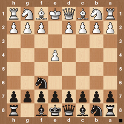
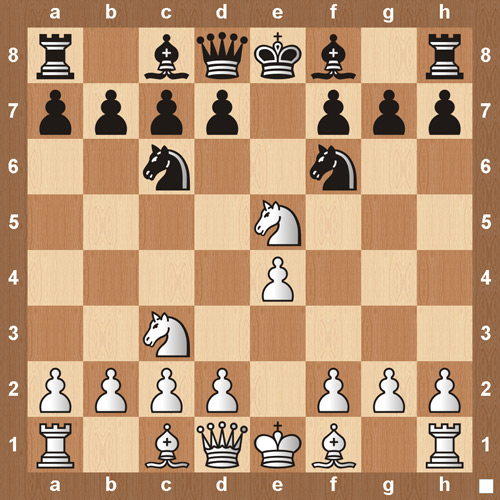

Chess openings
==============

* [Adelaide Counter Gambit](SUBSITES/Adelaide-Counter-Gambit.md) \

* [Albin Counter-Gambit](SUBSITES/Albin-Counter-Gambit.md) \

* [Alekhine Defense](SUBSITES/Alekhine-Defense.md) \

* [Apocalypse Attack](SUBSITES/Apocalypse-Attack.md) \

* [Baltic Defense](SUBSITES/Baltic-Defense.md) \

* [Belgrade Gambit](SUBSITES/Belgrade-Gambit.md) \

* [Benoni Defense](SUBSITES/Benoni-Defense.md) \

* [Bird’s Opening](SUBSITES/Bird’s-Opening.md) \

* [Bishop’s Opening](SUBSITES/Bishop’s-Opening.md) \

* [Black Knights Tango](SUBSITES/Black-Knights-Tango.md) \

* [Blackmar-Diemer Gambit](SUBSITES/Blackmar-Diemer-Gambit.md) \

* [Bogo Indian Defense](SUBSITES/Bogo-Indian-Defense.md) \

* [Bowlder Attack](SUBSITES/Bowlder-Attack.md) \

* [Budapest Gambit](SUBSITES/Budapest-Gambit.md) \

* [Calabrese Countergambit](SUBSITES/Calabrese-Countergambit.md) \

* [Caro-Kann](SUBSITES/Caro-Kann.md) \

* [Catalan Opening](SUBSITES/Catalan-Opening.md) \

* [Chigorin Defense](SUBSITES/Chigorin-Defense.md) \

* [Cochrane Gambit](SUBSITES/Cochrane-Gambit.md) \

* [Colorado Gambit](SUBSITES/Colorado-Gambit.md) \

* [Danish Gambit](SUBSITES/Danish-Gambit.md) \

* [Dutch Defense](SUBSITES/Dutch-Defense.md) \

* [Elephant Gambit](SUBSITES/Elephant-Gambit.md) \

* [English Opening](SUBSITES/English-Opening.md) \

* [Evans Gambit](SUBSITES/Evans-Gambit.md) \

* [Fajarowicz Gambit](SUBSITES/Fajarowicz-Gambit.md) \

* [Falkbeer Counter-Gambit](SUBSITES/Falkbeer-Counter-Gambit.md) \

* [Four Knights Game](SUBSITES/Four-Knights-Game.md) \

* [French Defense](SUBSITES/French-Defense.md) \

* [Fried Liver Attack](SUBSITES/Fried-Liver-Attack.md) \

* [Gianutio Counter Gambit](SUBSITES/Gianutio-Counter-Gambit.md) \

* [Giuoco Piano](SUBSITES/Giuoco-Piano.md) \

* [Goring Gambit](SUBSITES/Goring-Gambit.md) \

* [Grand Prix Attack](SUBSITES/Grand-Prix-Attack.md) \

* [Grob Attack](SUBSITES/Grob-Attack.md) \

* [Grunfeld Defense](SUBSITES/Grunfeld-Defense.md) \

* [Halloween Gambit](SUBSITES/Halloween-Gambit.md) \

* [Hungarian Defense](SUBSITES/Hungarian-Defense.md) \

* [Icelandic Gambit](SUBSITES/Icelandic-Gambit.md) \

* [Italian Game](SUBSITES/Italian-Game.md) \

* [Jerome Gambit](SUBSITES/Jerome-Gambit.md) \

* [King’s Gambit](SUBSITES/King’s-Gambit.md) \

* [Kings Indian Attack](SUBSITES/Kings-Indian-Attack.md) \

* [Kings Indian Defense](SUBSITES/Kings-Indian-Defense.md) \

* [Larsens Opening](SUBSITES/Larsens-Opening.md) \

* [Latvian Gambit](SUBSITES/Latvian-Gambit.md) \

* [Locock Gambit](SUBSITES/Locock-Gambit.md) \

* [Lolli Attack](SUBSITES/Lolli-Attack.md) \

* [London System](SUBSITES/London-System.md) \

* [Matinovsky Gambit](SUBSITES/Matinovsky-Gambit.md) \

* [Max Lange Attack](SUBSITES/Max-Lange-Attack.md) \

* [Mieses Opening](SUBSITES/Mieses-Opening.md) \

* [Muzio Gambit](SUBSITES/Muzio-Gambit.md) \

* [Nakhmanson Gambit](SUBSITES/Nakhmanson-Gambit.md) \

* [Napoleon Opening](SUBSITES/Napoleon-Opening.md) \

* [Nimzo Indian Defense](SUBSITES/Nimzo-Indian-Defense.md) \

* [Nimzowitsch Defense](SUBSITES/Nimzowitsch-Defense.md) \

* [Petrov Defense](SUBSITES/Petrov-Defense.md) \

* [Philidor Defense](SUBSITES/Philidor-Defense.md) \

* [Pirc Defense](SUBSITES/Pirc-Defense.md) \

* [Ponziani Opening](SUBSITES/Ponziani-Opening.md) \

* [Portuguese Gambit](SUBSITES/Portuguese-Gambit.md) \

* [Queens Gambit](SUBSITES/Queens-Gambit.md) \

* [Queens Indian Defense](SUBSITES/Queens-Indian-Defense.md) \

* [Relfsson Gambit](SUBSITES/Relfsson-Gambit.md) \

* [Reti Gambit](SUBSITES/Reti-Gambit.md) \

* [Reti Opening](SUBSITES/Reti-Opening.md) \

* [Rousseau Gambit](SUBSITES/Rousseau-Gambit.md) \

* [Ruy Lopez](SUBSITES/Ruy-Lopez.md) \

* [Scandinavian Defense](SUBSITES/Scandinavian-Defense.md) \

* [Schliemann Gambit](SUBSITES/Schliemann-Gambit.md) \

* [Scotch Gambit](SUBSITES/Scotch-Gambit.md) \

* [Scotch Game](SUBSITES/Scotch-Game.md) \

* [Semi-Slav](SUBSITES/Semi-Slav.md) \

* [Sicilian Defense](SUBSITES/Sicilian-Defense.md) \

* [Slav Defense](SUBSITES/Slav-Defense.md) \

* [Slav Geller Gambit](SUBSITES/Slav-Geller-Gambit.md) \

* [Smith Morra Gambit](SUBSITES/Smith-Morra-Gambit.md) \

* [Stafford Gambit](SUBSITES/Stafford-Gambit.md) \

* [Staunton Gambit Accepted](SUBSITES/Staunton-Gambit-Accepted.md) \

* [Steinitz Gambit](SUBSITES/Steinitz-Gambit.md) \

* [Steinitz Lewis Trap](SUBSITES/Steinitz-Lewis-Trap.md) \

* [Stonewall Attack](SUBSITES/Stonewall-Attack.md) \

* [Tennison Gambit](SUBSITES/Tennison-Gambit.md) \

* [The Alien Gambit Trap](SUBSITES/The-Alien-Gambit-Trap.md) \

* [The Three Knights Game](SUBSITES/The-Three-Knights-Game.md) \

* [Three-Pawn Gambit](SUBSITES/Three-Pawn-Gambit.md) \

* [Traxler Counter Attack](SUBSITES/Traxler-Counter-Attack.md) \

* [Trompowsky Attack](SUBSITES/Trompowsky-Attack.md) \

* [Urusov Gambit](SUBSITES/Urusov-Gambit.md) \

* [Veresov Attack](SUBSITES/Veresov-Attack.md) \

* [Vienna Game](SUBSITES/Vienna-Game.md) \

* [Wayward Queen Attack](SUBSITES/Wayward-Queen-Attack.md) \

* [Wing Gambit](SUBSITES/Wing-Gambit.md) \

